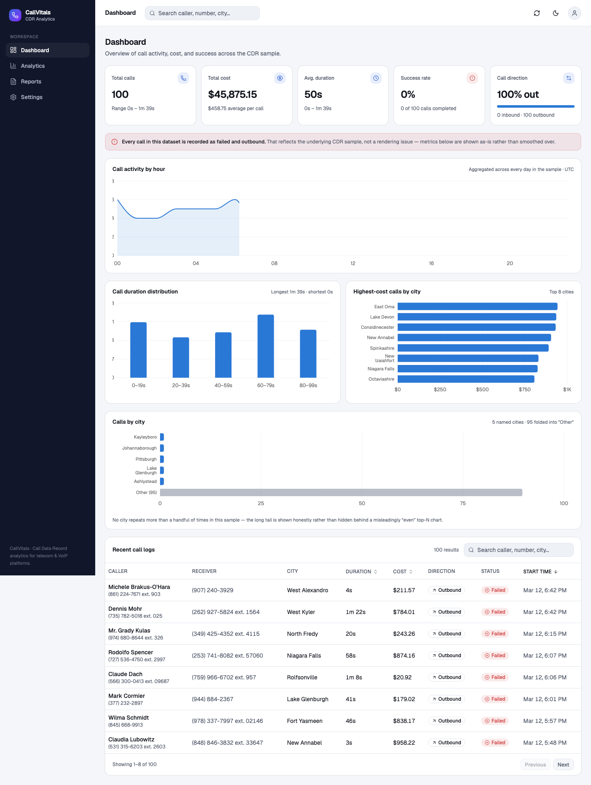
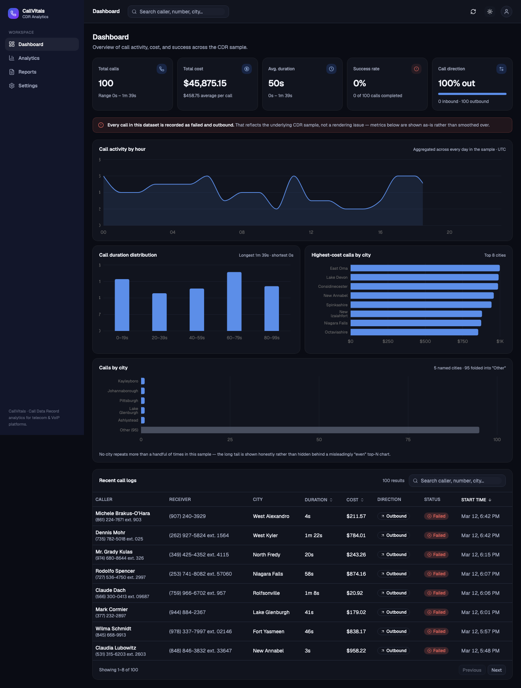
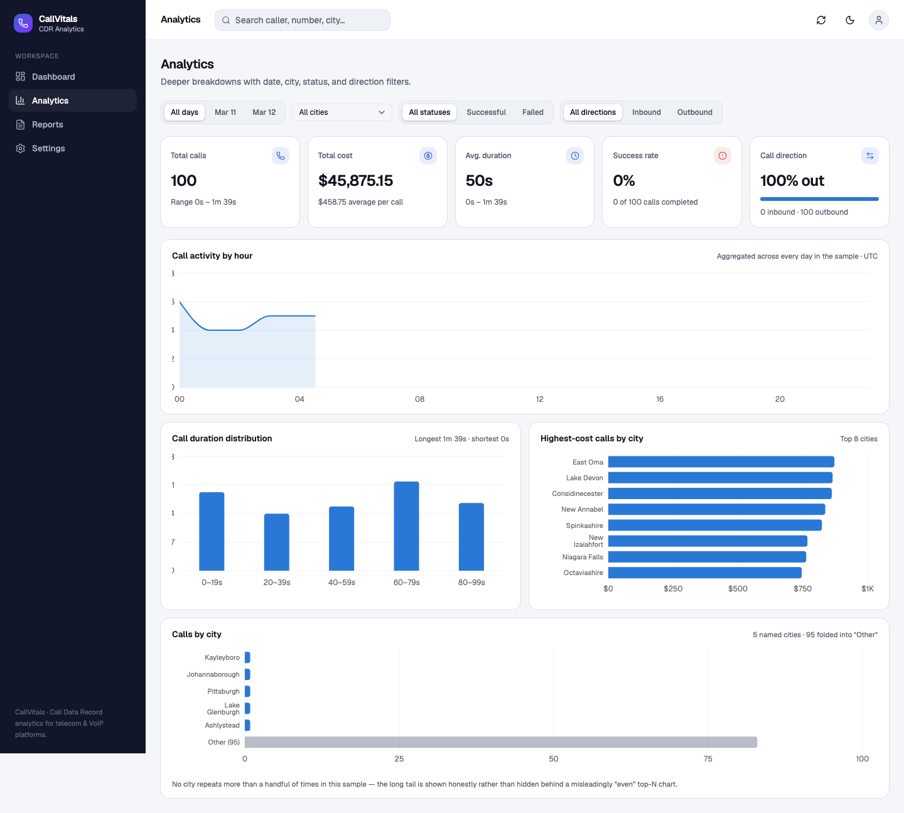
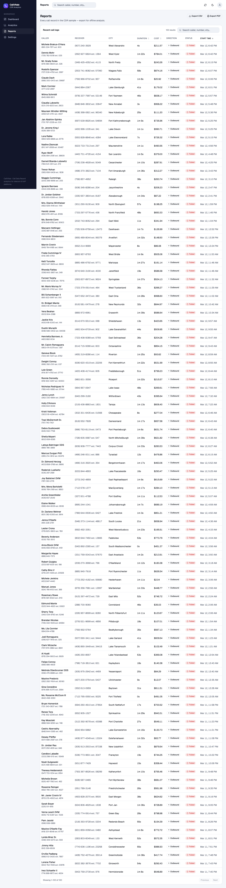

# CallVitals

A Call Analytics Dashboard for Call Data Records (CDR) — the kind of internal tool a telecom or VoIP platform would build to monitor call activity, cost, and success rates. Built as a professional, SaaS-style dashboard rather than a minimal assignment submission.

**Live app:** https://callvitals.vercel.app
**Repository:** https://github.com/Nifemie27/callvitals



## Contents

- [Project overview](#project-overview)
- [Features](#features)
- [Technology stack](#technology-stack)
- [Architecture](#architecture)
- [Folder structure](#folder-structure)
- [Installation](#installation)
- [Environment variables](#environment-variables)
- [Running locally](#running-locally)
- [Deployment](#deployment)
- [Screenshots](#screenshots)
- [Future improvements](#future-improvements)
- [Lessons learned](#lessons-learned)

## Project overview

CallVitals consumes a public CDR (Call Data Record) API and turns 100 raw call records into KPI summaries, cost and duration analytics, an hourly activity timeline, a city breakdown, and a searchable/sortable call log — across a Dashboard, a filterable Analytics view, and a printable/exportable Reports view.

The dataset backing this app is real, not curated for the demo: every call in the current sample happens to be recorded as **failed** and **outbound** (confirmed against the live API, not a bug). Rather than hide that, the dashboard surfaces it — a small notice explains it, KPI cards render the true 0%/100% split cleanly, and every chart has a defined empty state for exactly this situation.

## Features

**Dashboard**
- 5 KPI cards: total calls, total cost, average duration, success rate, call direction split
- 4 charts: hourly activity timeline, call duration distribution, highest-cost calls by city, calls by city (with an honest long-tail "Other" bucket instead of a misleadingly even top-N chart)
- Recent call logs table: search, sortable columns, pagination, status/direction badges

**Analytics**
- The same KPIs and charts, scoped by a filter bar (day, city, status, direction)
- Filter state syncs to the URL, so a filtered view is shareable and survives a refresh

**Reports**
- The full, unpaginated call log
- CSV export
- PDF export via the browser's print dialog (a dedicated print stylesheet drops the app chrome and forces light surfaces regardless of the active theme)

**Across the app**
- Light/dark/system theme, persisted, with no flash of the wrong theme on load
- Loading skeletons, error states with retry, and empty states — every async view has all three
- Keyboard-navigable, with visible focus indicators and screen-reader text alternatives on every chart

## Technology stack

| Layer | Choice |
|---|---|
| Build tool | Vite |
| UI library | React 19 + TypeScript |
| Styling | Tailwind CSS v4 |
| Components | shadcn/ui (Radix primitives) |
| Charts | Recharts, via shadcn's chart wrapper |
| Data fetching / caching | TanStack Query |
| HTTP client | Axios |
| Routing | React Router |
| Icons | Lucide |
| Dates | date-fns |
| Theme | next-themes |

## Architecture

The app is layered so that UI, data-fetching, and analytics logic can each change independently:

```
CDR API (mockapi.io)
   │
   ▼
services/api        — axios client, normalized ApiError, thin fetch function
   │
   ▼
services/mappers     — raw DTO → domain CallRecord (safe cost parsing,
   │                    isSuccessful()/isInbound() helpers, callDuration
   │                    as the only source of truth for duration)
   ▼
features/calls/hooks — useCallRecords (TanStack Query) and useCallAnalytics
   │                    (memoized, wraps the selectors below)
   ▼
features/calls/selectors — pure functions, no React dependency:
   │                        metrics · grouping · distribution · filtering
   ▼
components/*          — cards, charts, table, filters — receive
                         already-computed data, do no transformation
```

Two decisions worth calling out:

- **`callDuration` is the only source of truth for duration.** The CDR sample's `callEndTime - callStartTime` doesn't agree with the `callDuration` field (sometimes by tens of thousands of seconds, sometimes negative). Every duration metric derives from `callDuration` alone.
- **The Analytics day filter is derived from the dataset's own distinct dates**, not a hardcoded "today / last 7 days." The sample is dated in the past relative to any real "today," so a relative filter would always return zero rows.

## Folder structure

```
src/
├── app/                 # Providers (Query, theme, tooltip) and the router
├── pages/                # Route-level components: Dashboard, Analytics, Reports, Settings
├── components/
│   ├── layout/           # AppShell, Sidebar, TopNav, PageHeader
│   ├── cards/            # KpiCard, KpiCardGrid, DataQualityNotice
│   ├── charts/           # ChartCard wrapper + the 4 chart components + ChartsSection
│   ├── table/            # CallLogsTable, toolbar, badges, pagination
│   ├── filters/           # FilterBar (Analytics)
│   ├── feedback/         # ErrorState, EmptyState
│   └── ui/               # shadcn primitives (generated, not hand-written)
├── features/calls/
│   ├── hooks/            # useCallRecords, useCallAnalytics, useCallFilters
│   ├── selectors/        # metrics, grouping, distribution, filtering — pure functions
│   └── types.ts          # RawCallRecordDTO, CallRecord
├── services/
│   ├── api/              # axios client, endpoints, cdr.service
│   └── mappers/          # DTO → domain
├── lib/
│   ├── format/            # currency, duration, date, phone
│   ├── export/            # CSV export
│   └── utils.ts, query-client.ts
└── constants/             # nav, chart colors, query keys, API config
```

## Installation

```bash
git clone https://github.com/Nifemie27/callvitals.git
cd callvitals
npm install
```

## Environment variables

Copy `.env.example` to `.env` if you want to point at a different CDR endpoint — otherwise the app falls back to the public mock API used throughout development.

```bash
cp .env.example .env
```

| Variable | Description | Default |
|---|---|---|
| `VITE_CDR_API_URL` | Base URL for the CDR API | `https://69b30b45e224ec066bdb55a0.mockapi.io/api/v1/cdr` |

## Running locally

```bash
npm run dev       # start the dev server at http://localhost:5173
npm run build     # type-check (tsc -b) and produce a production build in dist/
npm run preview   # serve the production build locally
npm run lint       # run oxlint
```

## Deployment

Deployed on Vercel as a static Vite build:

- **Build command:** `npm run build`
- **Output directory:** `dist`
- **Framework preset:** Vite
- No environment variables are required for the default deployment (the public mock API is used as a fallback); set `VITE_CDR_API_URL` in the Vercel project settings to point at a different data source.
- **`vercel.json` rewrites every path to `index.html`.** This is a client-side-routed SPA (React Router), so without it, a direct request to `/analytics` or a refresh on `/reports` 404s on Vercel's static host — only `index.html` exists as a real file; the router handles everything past that in the browser.

## Screenshots

| Dashboard (light) | Dashboard (dark) |
|---|---|
|  |  |

| Analytics (filters) | Reports (export) |
|---|---|
|  |  |

## Future improvements

- A "demo mode" toggle that layers in synthetic inbound/successful calls for presentation purposes, without touching how real API data is handled
- A city combobox with type-ahead instead of a scrollable 100-item `<select>`, once the dataset's city cardinality is large enough to matter
- Server-side pagination/aggregation if the CDR API ever serves more than a few thousand records
- Unit tests for the selectors (`metrics`, `grouping`, `distribution`, `filtering`) — they're pure functions with no React dependency, so they're the highest-value, lowest-effort place to start
- Route-level code-splitting has already been applied to Analytics/Reports/Settings; the remaining bundle weight is Recharts + shadcn + Query + Router on the default Dashboard route, which would need a lighter charting library to reduce further

## Lessons learned

- **Pull the real data before designing anything.** The assignment's example numbers (250 calls, a healthy success/failure mix) don't match the actual API response — 100 records, 100 unique cities, and every single call recorded as failed and outbound. Every KPI card, chart, and empty state in this app was designed against that real distribution, not the illustrative one.
- **A mock API's fields aren't guaranteed internally consistent.** `callDuration` and `callEndTime - callStartTime` disagree throughout the dataset; treating one field as the single source of truth (and documenting why) avoided a whole class of confusing, hard-to-reproduce bugs.
- **Honesty scales better than smoothing.** Handling a 0%-success, 100%-outbound dataset gracefully — clean zero states, a plain-language notice, no fake data — turned out to be less work and more robust than trying to make the numbers "look better."
